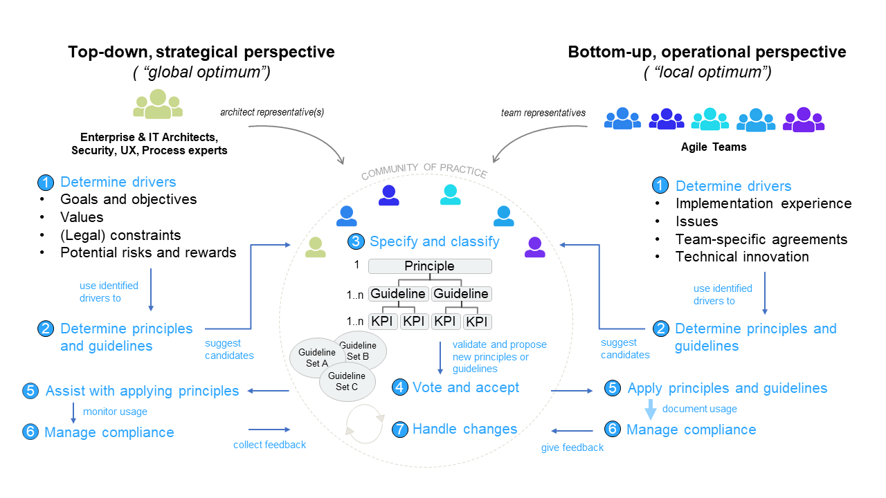

# Belt
The Belt is a tool that helps to communicate, document and establish guidelines, standards and best 
practices in a large scale agile development environment e.g. architecture guidelines, security 
policies, UX guidelines. It creates transparency on the compliance of agile teams with these guidelines 
and fosters collaboration. The accomplishment of a team is summarized in a belt similar to the belt 
concept in karate, e.g. the highest level is the black belt and the lowest level is the white belt. 

The tool can be used in (multiple) domains that are typically related to cross-cutting concerns or 
non-functional requirements in software development projects. When used for software architecture 
guidelines (e.g. technology stack, 12-factor app, resilience) the tool can be called Architecture Belt. 
In other domains the tool can be called UX Belt, Security Belt, Process Belt etc. 

In line with the agile approach agile teams are owners of the product/software and decide on the level of
maturity or belt they want to achieve, however overarching enterprise architects, security and UX 
experts can provide enterprise wide (global optimum) guidelines. Agile teams are also able to contribute
guidelines and best practices based on their practical experience. 

## Run the application 

### Client 
The client can be started with `npm run -dev` or `npm run-script dev` for development. 
To build the client for production please use `npm run-script build`.  

### Server
The server can be started using `go run main.go` for development. 
To build the server for production please use `go build main.go` to create an executable.  

## Contributing

The belt is a non-commercial tool that is developed and provided by the community of e.g. 
Architecture, Security, UX and Process Design experts. We appreciate your help! 

## Publications 

- Uludağ, Ö.; Nägele, S.; Hauder, M.: Establishing Architecture Guidelines in Large-Scale Agile 
Development Through Institutional Pressures, AMCIS: Americas Conference on Information Systems, 
Cancún, 2019.
- Uludağ, Ö.; Nägele, S.; Hauder, M.; Matthes, F.: A Tool Supporting Architecture Principles and 
Guidelines in Large-Scale Agile Development, Architecting the Digital Transformation, Springer, 2020. 
(To appear)